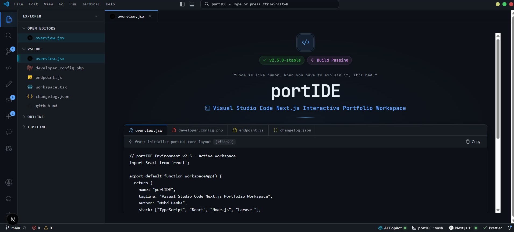

<div align="center">

# portIDE

**An immersive developer portfolio platform designed precisely to emulate a fully functional Visual Studio Code and multi-IDE workspace environment.**

[Live Demo](https://port-ide.vercel.app/) · [Report Bug](https://github.com/mhdhamka/portIDE/issues) · [Request Feature](https://github.com/mhdhamka/portIDE/issues)


</div>

---

## Overview

**portIDE** moves beyond traditional, static portfolios by functioning as an immersive, interactive developer workspace built with Next.js 16, Turbopack, and CSS Modules. It delivers an authentic IDE experience featuring a sidebar file explorer, active editor tabs, live code playgrounds, an AI-native composer agent, and real-time GitHub repository synchronization.

---

## Interactive Preview

<div align="center">



*Interactive VS Code emulation featuring live file switching, code sandbox preview, and telemetry status bars*

</div>

---

## Key Features

* **VS Code Layout Engine:** Interactive sidebar file explorer, active tabs management, status bar, and command palette (`Ctrl+Shift+P`).
* **Multi-IDE Engine Switcher:** Instantly toggle between Cursor AI-Native, JetBrains IDEA, and GitHub Codespaces environments with dynamic telemetry status updates.
* **Interactive Code Playground & Compiler:** Edit code inside live text sandboxes, choose between different file modules, run scripts, and view diagnostics in the terminal console.
* **Cursor AI Composer Agent (`Ctrl+I`):** Type custom prompt instructions to watch the AI agent rewrite code structures and inject updates into the active editor.
* **Live Git Source Control:** Real-time repository synchronization, branch management, file staging, diff inspector, and automated commit graphing.
* **Developer Analytics & Studio:** Integrated LeetCode statistics, Kanban sprint boards, and dynamic `changelog.json` schema updates.

---

## Tech Stack

| Category | Technology & Specification |
| :--- | :--- |
| **Framework** | Next.js 16 (App Router) |
| **Bundler & Compiler** | Turbopack |
| **Styling** | CSS Modules (Scoped Styling & Dark Mode Themes) |
| **Animations** | Framer Motion |
| **API & Integrations** | GitHub REST API (Automated Commits & Releases Stream) |

---

## Project Structure

```text

portIDE/
├── .github/                # GitHub configurations & workflows
├── .next/                  # Next.js build output
├── app/                    # Next.js App Router pages & API routes
├── components/             # IDE layout, sidebar, terminal & editor components
├── context/                # React context providers
├── lib/                    # Utility functions and shared logic
├── node_modules/           # Project dependencies
├── public/                 # Static assets & logos
├── styles/                 # Modular CSS stylesheets & theme variables
├── types/                  # TypeScript definitions and type interfaces
├── .env.example            # Example environment configuration
├── .env.local              # Local environment variables
├── .gitignore              # Git ignore rules
├── bun.lock                # Bun package manager lockfile
├── eslint.config.mjs       # ESLint configuration
├── next-env.d.ts           # Next.js TypeScript declarations
├── next.config.ts          # Next.js configuration
├── package-lock.json       # npm package manager lockfile
├── package.json            # Project dependencies and scripts
├── README.md               # Project documentation
├── tsconfig.json           # TypeScript configuration
└── tsconfig.tsbuildinfo    # TypeScript build information

```
---

## Getting Started

Clone the repository and run the development server locally:

```bash
git clone https://github.com/mhdhamka/portIDE.git
cd portIDE
npm install
cp .env.example .env.local
npm run dev

Open http://localhost:3000 with your browser to launch the workspace.
```
---
If you found this project interesting, consider giving it a star!

Developed & maintained by mhdhamka

</div>
